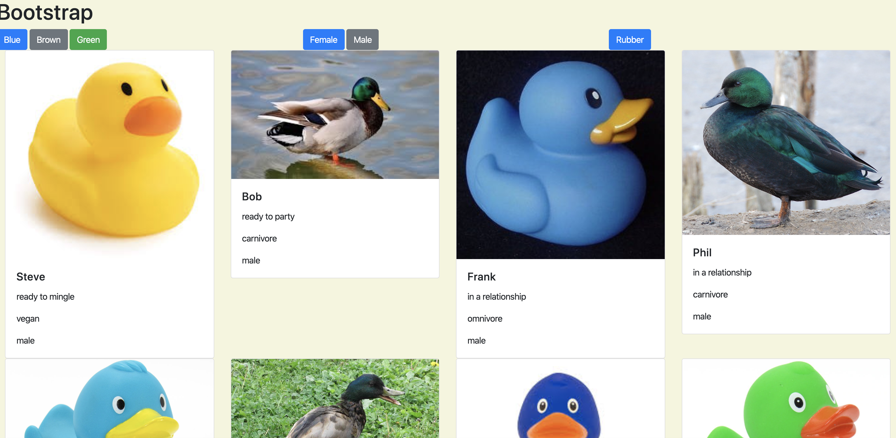

# Bootstrap

## Description
This project showcases use of bootstrap cards, which are displayed dynamically by looping through an array of objects containing information about the ducks.  We also add buttons to filter out the cards based on duck gender, color, and if the ducks are rubber or not.
## Screenshots

## How To Run
1. Clone down this repo.
2. Make sure you have http-server installed via npm.  If not get it [HERE](http://www.npmjs.com/package/http-server).
3. On your command line run `hs -p 8080`.
4. In your browser, navigate to `http://localhost:8080`.